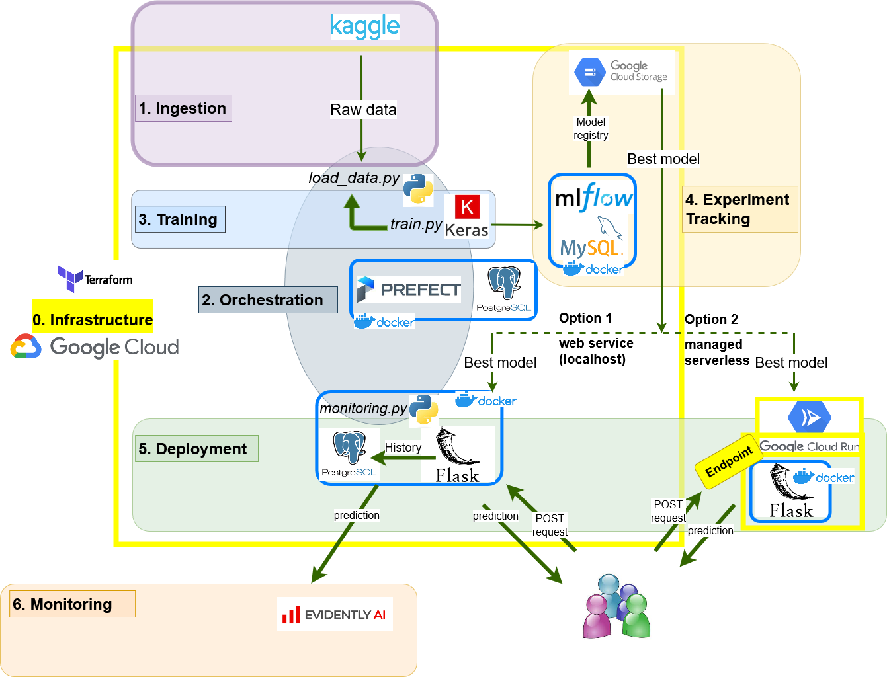

<!-- vscode-markdown-toc -->
- [Hello👋, I am Andrejs](#hello-i-am-andrejs)
- [Fake news detection](#fake-news-detection)
  - [Problem description](#problem-description)
    - [Importance](#importance)
    - [Project goals](#project-goals)
  - [Fast-track run](#fast-track-run)
  - [Project progress](#project-progress)
  - [Datasets](#datasets)
  - [Solution architecture](#solution-architecture)
  - [Project organization](#project-organization)
  - [Project components and reproducibility](#project-components-and-reproducibility)

<!-- vscode-markdown-toc-config
	numbering=false
	autoSave=true
	/vscode-markdown-toc-config -->
<!-- /vscode-markdown-toc -->

<!-- <div markdown=1> -->

[](https://fluentnumbers.github.io/)

<!-- [](https://www.linkedin.com/in/fedjajevs/) -->
<!-- [](https://medium.com/@fluentnumbers) -->

<!-- </div> -->

# Hello👋, I am [Andrejs](https://fluentnumbers.github.io/)
[](https://www.linkedin.com/in/fedjajevs/) [](https://medium.com/@fluentnumbers) 

I am a passionate data scientist and ML engineer on a continuous journey of **learning by doing**, and this is my MLOps portfolio project for the [MLOps Zoomcamp](https://github.com/DataTalksClub/mlops-zoomcamp/tree/main) course.


# Fake news detection


## <a name='Problemdescription'></a>Problem description
The expansion of information outlets in the digital era is akin to a two-sided coin. On one hand, it has equalized the distribution of knowledge and news, but on the other, it has facilitated the dissemination of misinformation and spurious news. Such misleading information has the potential to warp public conversation, sway personal convictions, and potentially manipulate the results of elections and public health policies.

### <a name='Importance'></a>Importance
Considering the significant implications, the urgency for robust and scalable methods to distinguish authentic news from misinformation is paramount. This is an area where the power of machine learning can be crucially employed.

### <a name='Projectgoals'></a>Project goals
This project goal is two-fold.
Apparent goal is to derive a machine learning model that can efficiently categorize news articles as genuine or fake, relying on their content and headline. We will harness natural language processing methodologies and advanced machine learning algorithms. Our model is designed to scrutinize the textual characteristics of news articles for its classification.

But the **actual learning goal** of the [MLOps Zoomcamp](https://github.com/DataTalksClub/mlops-zoomcamp/tree/main) is to create an example or template repository employing most up-to-date MLOps and data management practices. Therefore, we utilize the first goal above as a backbone to a comprehensive ML engineering workflow, spanning every stage of the MLOps process.
See [Solution architecture](#solution-architecture) for more information.

## Fast-track run
In short, to replicate the project one needs to:
1. Fullfil the [Pre-requisites](./PREREQUISITES.md)
2. Setup the [Infrastructure](./infrastructure/README.md)
3. Setup [Orchestration](./orchestration/README.md) and [Experiment tracking](./tracking/README.md)
4. [Deploy Prefect flows](./orchestration/README.md#deployment)
5. Run [model training](./training/README.md) at least once.
6. Deploy the best model as a web service either [locally](./deployment/README.md#local-webservice) or using [Cloud Run](./deployment/README.md#serverless-cloud-solution)
7. [Monitoring](./monitoring/README.MD)
8. [Best practices](./best%20practices/README.md)

For full understanding, please, refer to [Solution architecture](#solution-architecture), [Project organization](#project-organization), [full list of project components](#project-components-and-reproducibility) and overall [Project progress](./PROJECT_PROGRESS.md).

## <a name='Projectprogress'></a>Project progress
Project completion evaluation according to the Zoomcamp criteria see in [#Zoomcamp-criteria-self-evaluation](./PROJECT_PROGRESS.md#zoomcamp-criteria-self-evaluation).
See the overview of implemented features and TODOs in [PROJECT_PROGRESS.md](./PROJECT_PROGRESS.md#project-progress).


## <a name='Datasets'></a>Datasets
- This project is primarily based on [Fake and real news dataset @ Kaggle](https://www.kaggle.com/datasets/clmentbisaillon/fake-and-real-news-dataset)
> As [noted by the community](https://www.kaggle.com/datasets/clmentbisaillon/fake-and-real-news-dataset/discussion/167815), data collection methodology of this dataset is questionable, which is probably why it is possible to reach [very high accuracy scores close to 100%](https://www.kaggle.com/code/madz2000/nlp-using-glove-embeddings-99-87-accuracy).
>
> Though, this does not disturb the main goals of this project as it is focused on the MLOps and best software practices while working with ML tasks.
> This particular NLP application is just an example.
> Adding more datasets for training and validation is on the project [TODO list](./PROJECT_PROGRESS.md#data).


## <a name='Solutionarchitecture'></a>Solution architecture


## <a name='Projectorganization'></a>Project organization
- [ ] ==Generate tree and describe each folder\file==
```
+---archive
+---.git
|   +---hooks
|   +---branches
|   +-- ....
+---credentials
+---utilities
+---environment
+---tracking
|   \---mlflow
+---orchestration
|   +---server
|   +---agent
|   \---gcp_cloud
+---.vscode
+---training
+---deployment
|   +---google_cloud_run
|   |   \---artifact
|   |       +---tensorboard_logs
|   |       |   +---validation
|   |       |   \---train
|   |       \---model
|   |           \---data
|   |               \---model
|   |                   \---variables
|   \---web_service_local
\---data
```

## <a name='Projectcomponentsandreproducibility'></a>Project components and reproducibility

|                                               Area | Description                                                             |
|---------------------------------------------------:|-------------------------------------------------------------------------|
|        [Problem description](#problem-description) | Explains the project goals, motivation and general outline              |
|       [Infrastructure](./infrastructure/README.md) | Shows how to setup GCP project, cloud resources, venv, VM tooling, etc. |
|         [Orchestration](./orchestration/README.md) | Controlled and scheduled execution of _flows_ and _tasks_ using Prefect                                                                        |
|                   [Training](./training/README.md) | Train an LSTM model for text classification                                                                |
|               [Deployment](./deployment/README.md) | Deploy the model as a service for inference                                                                         |
|               [Monitoring](./monitoring/README.md) |                                                                       |
| [Best practices](./best%20practices/README.md) |   unit-testing, integration tests, auto-formatting, etc.                                                                 |
