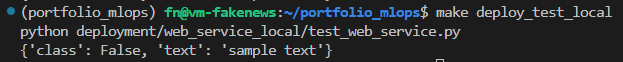
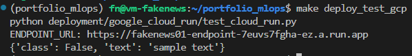
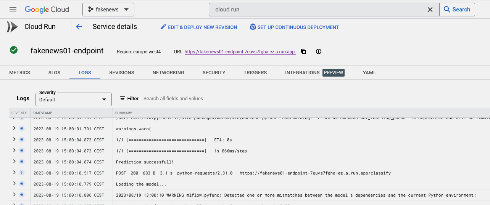

  

<!-- vscode-markdown-toc -->
- [Deployment](#deployment)
		- [Pre-requisites](#pre-requisites)
		- [Local webservice](#local-webservice)
		- [Serverless cloud solution](#serverless-cloud-solution)

<!-- vscode-markdown-toc-config
	numbering=false
	autoSave=true
	/vscode-markdown-toc-config -->
<!-- /vscode-markdown-toc -->


# Deployment

Deployment is possible as a [local Flask app in a Docker container](#local-webservice) or as a [Google Cloud Run serverless function](#serverless-cloud-solution).

### <a name='Pre-requisites'></a>Pre-requisites
Deployed web services will try to download training artifacts from `$MLFLOW_ARTIFACT_LOCATION` (GCP bucket). In order for this to be successful you need to run the [model trainining](../training/README.md) successfully at least once.


### <a name='Localwebservice'></a>Local webservice

Run `make deploy_local_up` to start [docker-compose](./web_service_local/docker-compose.yaml) from [deployment/web_service_local](./web_service_local/)
```bash
deploy_local_up:
# Deploy the best model for inference as a local web-service in a container
	cd deployment/web_service_local && docker-compose up && cd -
```
The container has `gcloud` installed and can fetch MLOps artifacts from GCP bucket. It runs [fetch_model.py](./web_service_local/fetch_model.py) to download the best available model. Then it starts a `gunicorn` server and ready to classify any text sent via the `POST` request to `${DEPLOYMENT_WEB_SERVICE_LOCAL_PORT}`.

This model can be tested using `make deploy_test_local`, which will update the environmental varialbles and run [test_web_service.py](./web_service_local/test_web_service.py)




#### Storing incoming requests
If deployment is [local](#local-webservice), then the [docker-compose](./web_service_local/docker-compose.yaml) also has a container with Postgres database. Every time a POST request is being sent to the web service, the text and prediction is stored for [Monitoring](../monitoring/README.MD) purposes.


### <a name='Serverlesscloudsolution'></a>Serverless cloud solution

Run `make deploy_to_gcp` to start [Cloud Run](https://cloud.google.com/run) deployment
```bash
deploy_to_gcp:
# envvar are not available inside docker build by default and gcloud build doesn't have --build-arg:
# https://til.simonwillison.net/cloudrun/using-build-args-with-cloud-run
	cd deployment/google_cloud_run && \
	gcloud services enable run.googleapis.com && \
	gcloud services enable cloudbuild.googleapis.com && \
	python fetch_model.py && \
	source deploy.sh && \
	cd -
```
Unlike the [local web service](#local-webservice), Cloud Run function has no communication to the MLflow database\client __yet__ and can't fetch info about models during run-time.
This TODO is present in the general [Project progress](../PROJECT_PROGRESS.md#deployment) document.
As a workaround, the `make` command **first fetches the best model artifacts to a local folder** and then executes the [`deploy.sh`](./google_cloud_run/deploy.sh) script.
`deploy.sh` is needed to assemble the `gcloud run deploy` command and temporary (created and deleted in `deploy.sh`) `cloudbuild.yml` `gcloud` configuration file.
For more information see https://til.simonwillison.net/cloudrun/using-build-args-with-cloud-run

<!-- [docker-compose](./google_cloud_run/docker-compose.yaml), [classify.py](./google_cloud_run/classify.py) and [fetch_model.py](./google_cloud_run/fetch_model.py) in [deployment/google_cloud_run](./google_cloud_run/) are nearly identical to those from the [local deployment](#local-webservice). -->

When the service is available, `make deploy_test_gcp` can test it. See [test_cloud_run.py](./google_cloud_run/test_cloud_run.py) for clarification.



If smth goes wrong, extensive logs can be found at Cloud Run service details:


[Previous: Training](../training/README.md) | [Next: Monitoring](../monitoring/README.md)
