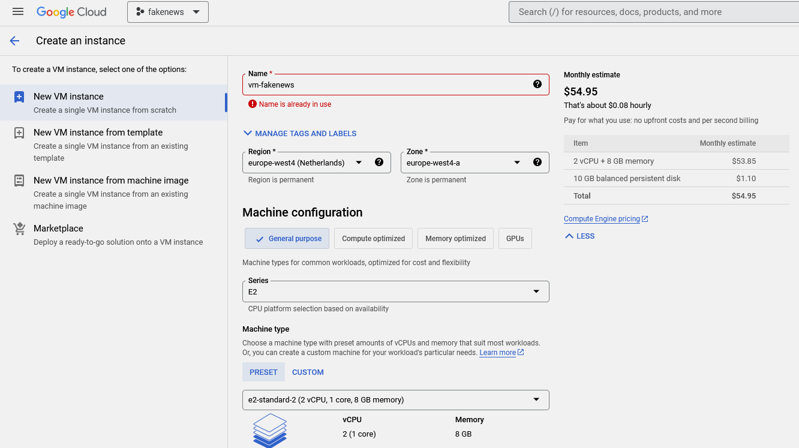
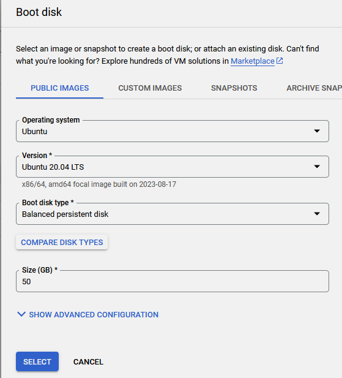
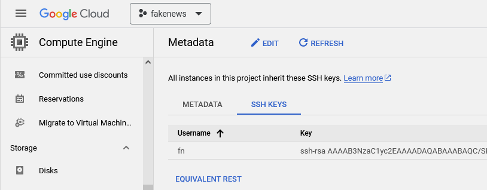
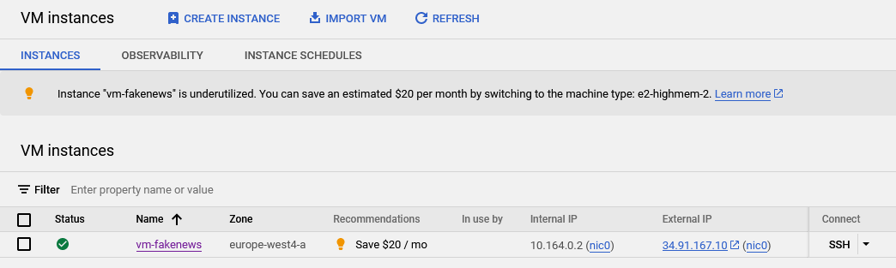

<!-- vscode-markdown-toc -->
- [Infrastructure](#infrastructure)
  - [Create a compute Instance \\ Virtual Machine (VM)](#create-a-compute-instance--virtual-machine-vm)
  - [Setup remote access to your VM](#setup-remote-access-to-your-vm)
    - [Generate an SSH key pair](#generate-an-ssh-key-pair)
    - [Add the public key to the Compute Engine metadata](#add-the-public-key-to-the-compute-engine-metadata)
    - [Start the VM and get the external IP](#start-the-vm-and-get-the-external-ip)
    - [Update/create a config file in your local `~/.ssh` directory](#updatecreate-a-config-file-in-your-local-ssh-directory)
    - [Remote login to VM](#remote-login-to-vm)
  - [Setup the remote environment on the VM](#setup-the-remote-environment-on-the-vm)
    - [Clone Git repository](#clone-git-repository)
    - [Move credentials to the VM](#move-credentials-to-the-vm)
    - [Other preparation steps on the VM](#other-preparation-steps-on-the-vm)
      - [VM update and install tools](#vm-update-and-install-tools)
      - [Install base Python 3.10](#install-base-python-310)
  - [Configuration](#configuration)
    - [env file](#env-file)
    - [makefile](#makefile)
      - [Install required tools](#install-required-tools)
    - [Install python virtual environment](#install-python-virtual-environment)
  - [GCP infrastructure setup with Terraform](#gcp-infrastructure-setup-with-terraform)
<!-- vscode-markdown-toc-config
	numbering=false
	autoSave=true
	/vscode-markdown-toc-config -->
<!-- /vscode-markdown-toc -->

# Infrastructure
   

## <a name='CreateacomputeInstanceVirtualMachineVM'></a>Create a compute Instance \ Virtual Machine (VM)
- Go to [Compute Engine API](https://console.cloud.google.com/marketplace/product/google/compute.googleapis.com) and enable it if not active yet.
- Create a new VM. I called the VM `vm-fakenews`. Choose suitable compute resources (≥8 Gb RAM), region\zone.




## <a name='SetupremoteaccesstoyourVM'></a>Setup remote access to your VM
### <a name='GenerateanSSHkeypair'></a>Generate an SSH key pair
[Create SSH keys](https://cloud.google.com/compute/docs/connect/create-ssh-keys)
`ssh-keygen -t rsa -f %KEYFILE_NAME% -C %USER_NAME% -b 2048`
as in `ssh-keygen -t rsa -f fakenews -C fn -b 2048`

This will create a public (*gcp.pub*) and private (*gcp*) key-files in your _*~/.ssh*_ directory

### <a name='AddthepublickeytotheComputeEnginemetadata'></a>Add the public key to the Compute Engine metadata
Compute Engine >> Metadata >> SSH keys



### <a name='StarttheVMandgettheexternalIP'></a>Start the VM and get the external IP
Go to the VM, check the check box and press start if it's not already running. Copy the External IP address that is displayed once it starts:




### <a name='Updatecreateaconfigfileinyourlocal.sshdirectory'></a>Update/create a config file in your local `~/.ssh` directory
You can then create a config file in your .ssh directory and add the following entry:
```
Host <name to use when connecting>
    HostName <public IP address>
    User <User name you chose when running the ssh-keygen command>
    IdentityFile /home/<local user name>/.ssh/<your private key>
```
as in
```
Host fakenews
    HostName 34.141.225.195
    User fn
    IdentityFile C:\Users\320188473\.ssh\fakenews
```

### <a name='RemotelogintoVM'></a>Remote login to VM
Now you can run `ssh fakenews` in your terminal to connect to the VM.

## <a name='SetuptheremoteenvironmentontheVM'></a>Setup the remote environment on the VM
### <a name='CloneGitrepository'></a>Clone Git repository
`git clone https://github.com/fluentnumbers/portfolio_mlops.git`

### <a name='MovecredentialstotheVM'></a>Move credentials to the VM
- **locally** `cd` to where you stored your GCP service account credentials file `fakenews01.json`.
- `sftp fakenews` (or your hostname in *.ssh/config*)
- `put fakenews01.json portfolio_mlops/credentials/fakenews01` to transfer the files to the VM. All files inside the *credentials* directory are added to *.gitignore*.
- You could also transfer [Kaggle](../PREREQUISITES.md#kaggle) credentials the same way, but in this project we will work with environmental variables directly.
- `exit` sftp

> **NOTE**
> You might need to set restrictive permissions on credentials
> `chmod 600 /home/fn/portfolio_mlops/credentials/fakenews01.json`

### <a name='OtherpreparationstepsontheVM'></a>Other preparation steps on the VM

#### VM update and install tools
```
sudo apt-get update
sudo apt-get install make -y
sudo apt-get install wget
sudo apt-get pipenv -y
```

#### Install base Python 3.10
You should have base Python 3.10 installed on the VM in order to [create *venv*](#install-python-virtual-environment) from that.
[Below](#install-python-virtual-environment) is explained how to install miniconda package using a `make vm_install_conda` command.


## <a name='Configuration'></a>Configuration
### <a name='envfile'></a>env file

Go to the [_.env_sample_](../.env_sample), copy and rename it to _.env_ (**git-ignored**) and check the file for necessary changes, but at the very least you need to adjust the onse marked by `# CHANGE_THIS` comment.

Don't forget to fill in `KAGGLE_USERNAME` and `KAGGLE_KEY` with your [Kaggle credentials](../PREREQUISITES.md#kaggle)

> **Note**
> Dont leave spaces in *.env* lines before or after the `=` sign.
>
```shell
...
...
############################################
################# GCP
##############################################
# CHANGE_THIS
GCP_PROJECT_ID=fakenews01
# CHANGE_THIS
GCP_CREDENTIALS_PATH=/home/fn/portfolio_mlops/credentials/fakenews01-8672abe6ee38.json
# CHANGE_THIS: bucket name should be unique, recommended somename_${GCP_PROJECT_ID}
GCP_BUCKETNAME=bucket_fakenews01
# CHANGE_THIS
GCP_REGION=europe-west4

# folder for storing raw data locally and in the GCP bucket
GCP_RAW_DATA_SUBFOLDER=data


#############################################
################# MLFLOW
##############################################
# MLFLOW_TRACKING_URI defined inside Makefile as http://localhost:${MLFLOW_TRACKING_URI}
############################# MLFLOW_TRACKING_URI=http://localhost:5000

MLFLOW_SERVER_PORT=5000

# MLFLOW_ARTIFACT_LOCATION defined inside Makefile as gs://${GCP_BUCKETNAME}/${MLFLOW_ARTIFACT_SUBFOLDER}
############################ MLFLOW_ARTIFACT_LOCATION=gs://bucket_fakenews01/mlflow
...
...
```


### <a name='makefile'></a>makefile
[*Makefile*](../Makefile) contains a list of shortcuts commands for semi-automated execution of the project. Note that each *make* command is run in its own shell and *.env* file is loaded every time. That means that simply executing make target as shell commands (by copy-pasting into the terminal) may not always work correctly.

#### <a name='Installrequiredtools'></a>Install required tools
- `make gcp_auth` to make it possible to use `gcloud` and `gsutils` from the terminal.
```bash
gcp_auth:
    gcloud auth activate-service-account --key-file ${GOOGLE_APPLICATION_CREDENTIALS}
```

- `make vm_install_docker`
```shell
# make vm_install_docker
vm_install_docker:
    sudo apt-get install docker.io -y;\
    sudo groupadd docker;\
    sudo gpasswd -a ${USER} docker
    sudo service docker restart
```
Check it with `docker --version`

- `make vm_install_docker_compose`
```shell
# make vm_install_docker_compose
vm_install_docker_compose:
    sudo apt install docker docker-compose python3-pip make -y
    sudo chmod 666 /var/run/docker.sock
```
Check it with `docker-compose --version`

- `make vm_install_terraform`
```shell
# make vm_install_terraform
vm_install_terraform:
	cd /home/$(USER);\
	wget https://releases.hashicorp.com/terraform/1.5.4/terraform_1.5.4_linux_amd64.zip;\
    unzip -o terraform_1.5.4_linux_amd64.zip;\
    rm terraform_1.5.4_linux_amd64.zip;\
    sudo mv terraform /usr/local/bin/
```
Check it with `terraform --version`

### <a name='Installpythonvirtualenvironment'></a>Install python virtual environment

> **Pre-requisite**
> You should have base Python 3.10 installed on the VM in order to create *venv* from that.
> One can use `make vm_install_conda` (to install the miniconda package from https://repo.anaconda.com/miniconda/Miniconda3-py310_23.5.2-0-Linux-x86_64.sh).

- `make setup_venv`
```shell
# make setup_venv
setup_venv:
    pip install -U pip
    pip install pipenv
    pipenv install --dev
    pipenv run pip install tf-nightly -q
    pre-commit install
```

## <a name='GCPinfrastructuresetupwithTerraform'></a>GCP infrastructure setup with Terraform
- `make trf_apply` will create a bucket named `${GCP_BUCKETNAME}` (as set in your [*.env*](#env-file)) inside your project's GCP storage
```shell
# make trf_apply
trf_apply:
# echo ${TF_VAR_data_lake_bucket}
    cd infrastructure/terraform && \
    terraform init && \
    terraform plan && \
    terraform apply -auto-approve && \
    cd -
```


[Previous: Prerequisites](../PREREQUISITES.md) | [Next: Orchestration](../orchestration/README.md)
