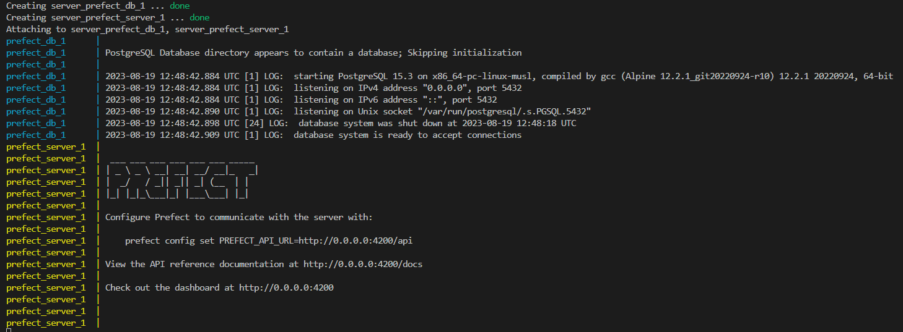
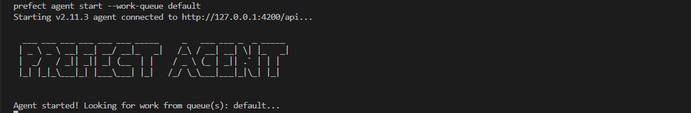
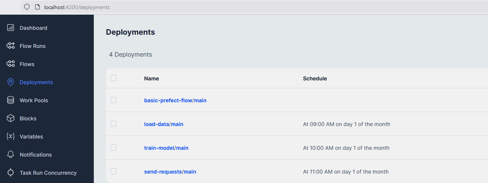

  

<!-- vscode-markdown-toc -->
- [Orchestration](#orchestration)
  - [Prefect setup](#prefect-setup)
    - [Prefect server](#prefect-server)
    - [Prefect agent](#prefect-agent)
  - [Deployment](#deployment)

<!-- vscode-markdown-toc-config
	numbering=false
	autoSave=true
	/vscode-markdown-toc-config -->
<!-- /vscode-markdown-toc -->


# <a name='Orchestration'></a>Orchestration

## <a name='Prefectsetup'></a>Prefect setup
Prefect is used as the orchestration platform for the project. It's server (Orion) and backend database (Postgres) are deployed using [docker-compose](./server/docker-compose.yaml). Prefect agent is run locally on the VM

**Before [Training](../training/README.md) the model both server and agent must be started.** This can be done using [Make](../Makefile) commands.

### Prefect server
- `make pr_srv_up` (use `make pr_srv_down` to turn the container off)
```bash
pr_srv_up:
# start containers with prefect server (orion) and Postgres database
    cd orchestration/server && docker-compose up --build && cd -
```


### Prefect agent
- `make pr_ag_up`
```bash
pr_ag_up:
# start Prefect agent locally
# PLACEHOLDER FOR CONTAINERIZED RUN: cd orchestration/agent && docker-compose up --build && cd -
    prefect agent start --work-queue default
```



## Deployment

Once [Prefect server](#prefect-server) is up, `make pr_deploy` can be used to deploy the [data loading](../training/load_data.py) and [training scripts](../training/train.py) as Prefect flows. This make command executes [prefect_create_deployments.sh](../orchestration/prefect_create_deployments.sh) to create necessary Prefect blocks based on the information provided in your [.env](../infrastructure/README.md#env-file) file and then creates two deployments.

By default both deployments are scheduled to run on the 1st day of each month.

```bash
pr_deploy:
# 1. create Prefect blocks (credential, storage, etc.)
# 2. Create deployments for load_data.py and train.py
	source orchestration/prefect_create_deployments.sh
```

- ###### prefect_create_deployments.sh
```bash
echo --------------------------- Create Prefect blocks -----------------------------------------------
python ./orchestration/create_blocks.py

echo --------------------------- Create Prefect deployment for /training/load_data.py ---------------------
python ./training/load_data.py
echo ------ One can run \"prefect deployment run load-data/main\" to load raw data

echo --------------------------- Create Prefect deployment for /training/train.py --------------------------
python ./training/train.py
echo ----- One can run \"prefect deployment run train-model/main\" to train and register the best model

echo --------------------------- Create Prefect deployment for /monitoring/simulate_requests.py --------------------------
python ./monitoring/simulate_requests.py
echo ----- One can run \"prefect deployment run send-requests/main\" to simulate sending requests to a local web server
```




[Previous: Infrastructure](../infrastructure/README.md) | [Next: Tracking](../tracking/README.md)
