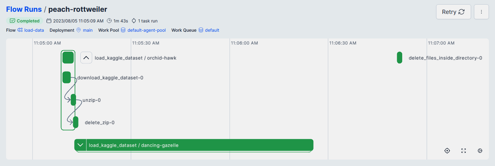

<!-- vscode-markdown-toc -->
- [Training](#training)
	- [Pre-requisites](#pre-requisites)
	- [Data loading](#data-loading)
	- [Model training](#model-training)

<!-- vscode-markdown-toc-config
	numbering=false
	autoSave=true
	/vscode-markdown-toc-config -->
<!-- /vscode-markdown-toc -->

# Training

## <a name='Pre-requisites'></a>Pre-requisites

[Model training](#model-training) is [orchestrated](../orchestration/README.md) using Prefect and [tracked](../tracking/README.md) using MLflow.
Both services must be started in advance. Refer to the corresponding sections: [Orchestration](../orchestration/README.md), [Tracking](../tracking/README.md).

## <a name='Dataloading'></a>Data loading
[load_data.py](../training/load_data.py) fetches pre-defined [datasets](../README.md#datasets) and loads that *raw* data into the GCP bucket [created](../infrastructure/README.md#gcp-infrastructure-setup-with-terraform) during the infrastructure setup.

Assuming load_data.py and train.py are present in Prefect as deployments, running `make load_data` will load raw data from Kaggle to the GCP bucket.
```bash
load_data:
# Run load_data.py Prefect deployment
    prefect deployment run load-data/main
```



## <a name='Modeltraining'></a>Model training

[train.py](../training/train.py) loads data from the GCP bucket to a local `${GCP_RAW_DATA_SUBFOLDER}` and runs model training flows.
Run it as a Prefect deployment with `make train_model`:
```bash
train_model:
# Run train.py Prefect deployment
	prefect deployment run train-model/main
```
Training may last longer time (depending on your VM resources), but it takes `--n_trials` (default 2) and `n_epochs` (default 2) arguments.
Running `make train_model_fast` sets both of them to 1.
```bash
train_model_fast:
# Run train.py Prefect deployment with custom arguments
	prefect deployment run train-model/main --param n_trials=1 --param n_epochs=1
```
For full understanding of the training process, see [train.py](./train.py).

Resulting models are stored in model registry at `${MLFLOW_ARTIFACT_LOCATION}`, the best model is registered and promoted to *Production* stage.
By [Deployment](../deployment/README.md) the best performing model is fetched automatically.

The model builds on ideas from [this Kaggle notebook](https://www.kaggle.com/code/madz2000/nlp-using-glove-embeddings-99-87-accuracy) and other Zoomcamp projects.

> [!NOTE]
> The [main learning goal](../README.md#project-goals) of this project was to **build an MLOps pipeline**, not to train a good ML model for a particular application. Therefore training process and scripts are provided more as placeholders and can't be used as best performance examples.


[Previous: Tracking](../tracking/README.md) | [Next: Tracking](../deployment/README.md)
